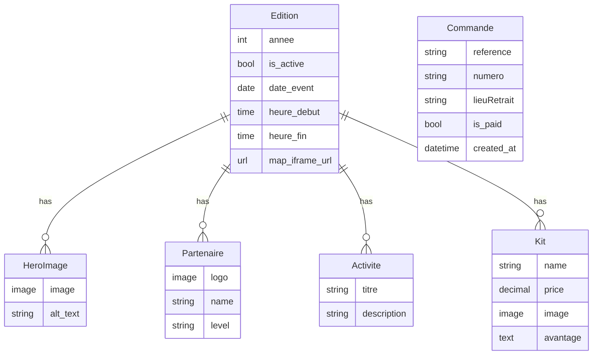

# 📊 Analyse Complète du Projet PORO Run

> **Projet Django 6.0.1** - Application web pour la gestion d'événements de course à pied "PORO Run"
> 
> **Date d'analyse** : 5 février 2026

---

## 🎯 Vue d'Ensemble

**PORO Run** est une application Django conçue pour gérer des événements de course à pied annuels. L'application permet :
- La gestion d'éditions annuelles d'événements
- La vente de kits de participation
- La gestion des partenaires et activités
- Le traitement des commandes en ligne

---

## 📁 Structure du Projet

```
PORO/
├── RUN/                    # Configuration Django principale
│   ├── settings.py         # Paramètres du projet
│   ├── urls.py            # URLs principales
│   ├── wsgi.py            # Configuration WSGI
│   └── asgi.py            # Configuration ASGI
│
├── core/                   # Application principale
│   ├── models.py          # Modèles de données
│   ├── views.py           # Vues/Contrôleurs
│   ├── urls.py            # Routes de l'application
│   ├── admin.py           # Configuration admin Django
│   ├── templates/         # Templates HTML
│   │   ├── base.html
│   │   └── partials/      # Composants réutilisables
│   │       ├── acceuil/
│   │       ├── achat/
│   │       ├── kit_poro/
│   │       └── message/
│   ├── static/            # Fichiers statiques (CSS, JS, images)
│   └── migrations/        # Migrations de base de données
│
├── env/                   # Environnement virtuel Python
├── db.sqlite3            # Base de données SQLite
├── manage.py             # Script de gestion Django
├── requirements.txt      # Dépendances Python
└── .gitignore           # Fichiers à ignorer par Git
```

---

## 🗄️ Modèles de Données (Base de Données)

### 1. **Edition** - Gestion des éditions annuelles
```python
- annee (IntegerField)           # Année de l'édition (unique)
- is_active (BooleanField)       # Édition active ou non
- date_event (DateField)         # Date de l'événement
- heure_debut (TimeField)        # Heure de début (défaut: 08:00)
- heure_fin (TimeField)          # Heure de fin (défaut: 22:00)
- map_iframe_url (URLField)      # URL Google Maps de l'événement
```

**Relations :**
- Une édition → Plusieurs images hero (`hero_images`)
- Une édition → Plusieurs partenaires (`partenaire`)
- Une édition → Plusieurs activités (`activite`)
- Une édition → Plusieurs kits (`kit`)

---

### 2. **HeroImage** - Images d'ambiance
```python
- edition (ForeignKey)           # Édition associée
- image (ImageField)             # Image uploadée (dossier: hero/)
- alt_text (CharField)           # Texte alternatif (défaut: "ambiance poro run")
```

---

### 3. **Partenaire** - Sponsors de l'événement
```python
- edition (ForeignKey)           # Édition associée
- logo (ImageField)              # Logo du partenaire (dossier: media)
- name (CharField)               # Nom du partenaire (max 50 car.)
- level (CharField)              # Niveau: Or, Platine, Bronze (max 20 car.)
```

---

### 4. **Activite** - Activités de l'événement
```python
- edition (ForeignKey)           # Édition associée
- titre (CharField)              # Titre de l'activité (max 100 car.)
- description (CharField)        # Description (max 255 car.)
```

---

### 5. **Kit** - Kits de participation
```python
- edition (ForeignKey)           # Édition associée
- name (CharField)               # Nom du kit (max 100 car.)
- price (DecimalField)           # Prix (10 chiffres, 0 décimales)
- image (ImageField)             # Image du kit (dossier: kits)
- avantage (TextField)           # Liste des avantages (séparés par virgules)
```

**Méthode personnalisée :**
```python
def avantages(self):
    return [f.strip() for f in self.avantage.split(',')]
```
> Convertit la chaîne d'avantages en liste Python

---

### 6. **Commande** - Gestion des commandes
```python
- reference (CharField)          # Code unique généré (8 caractères)
- numero (CharField)             # Numéro de téléphone (max 20 car.)
- lieuRetrait (CharField)        # Lieu de retrait du kit (max 30 car.)
- is_paid (BooleanField)         # Statut de paiement (défaut: False)
- created_at (DateTimeField)     # Date de création (auto)
```

**Génération automatique de référence :**
```python
def generer_code():
    chars = string.ascii_uppercase + string.digits
    return ''.join(random.choices(chars) for _ in range(8))
```

**Lieux de retrait disponibles :**
- Korhogo Centre - Place de la Paix
- Korhogo - Quartier Sinistré
- Korhogo - Soba
- Korhogo - DEM
- Korhogo - Haoussabougou
- Korhogo - Cocody
- Ferkessédougou - Centre ville
- Boundiali - Centre ville

---

## 🎨 Vues et Logique Métier

### `get_active_edition()`
Récupère l'édition active actuelle
```python
def get_active_edition():
    return Edition.objects.filter().first()
```

> ⚠️ **Bug identifié** : Le filtre est vide, il devrait filtrer par `is_active=True`

---

### `home(request)`
Vue principale de la page d'accueil
```python
- Récupère l'édition active
- Charge les images hero
- Charge les activités
- Charge les partenaires
- Rend le template 'partials/hero.html'
```

> ⚠️ **Bugs identifiés** :
> - `edition.Activite` → devrait être `edition.activite`
> - `edition.Partenaire` → devrait être `edition.partenaire`

---

### `kit_view(request)`
Vue pour afficher les kits disponibles
```python
- Récupère l'édition active
- Charge tous les kits de l'édition
- Rend le template 'partials/kit.html'
```

> ⚠️ **Bug identifié** : `edition.Kits` → devrait être `edition.kit`

---

## ⚙️ Configuration (settings.py)

### Technologies utilisées
- **Framework** : Django 6.0.1
- **Base de données** : SQLite3 (`db.sqlite3`)
- **Mode** : DEBUG = True (développement)

### Applications installées
- Applications Django standards (admin, auth, sessions, etc.)
- **core** : Application personnalisée

### Configuration importante
- **SECRET_KEY** : ⚠️ Clé visible dans le code (à changer en production)
- **ALLOWED_HOSTS** : Vide (à configurer pour la production)
- **LANGUAGE_CODE** : 'en-us'
- **TIME_ZONE** : 'UTC'

---

## 🔗 Configuration des URLs

### URLs principales (`RUN/urls.py`)
```python
urlpatterns = [
    path('admin/', admin.site.urls),      # Interface d'administration
    path('', include('core.urls')),       # Routes de l'application core
]
```

### URLs de l'application (`core/urls.py`)
```python
urlpatterns = [
    path('', home, name='home'),          # Page d'accueil
]
```

> ⚠️ **Route manquante** : `kit_view` n'est pas exposée dans les URLs

---

## 🛠️ Administration Django

Modèles enregistrés dans l'admin :
- ✅ Kit
- ✅ Partenaire
- ✅ Activite
- ✅ Commande

> ⚠️ **Modèles manquants** dans l'admin :
> - Edition
> - HeroImage

---

## 📦 Dépendances (requirements.txt)

```
asgiref==3.11.0
Django==6.0.1
sqlparse==0.5.5
tzdata==2025.3
```

> ⚠️ **Dépendances manquantes** :
> - **Pillow** : Nécessaire pour `ImageField`
> - Pas de gestionnaire de paiement configuré

---

## 🐛 Bugs et Problèmes Identifiés

### 🔴 **Critiques**

1. **`models.py` - Virgules dans les définitions**
   ```python
   # ❌ Incorrect
   annee = models.IntegerField("année", unique=True),
   
   # ✅ Correct
   annee = models.IntegerField("année", unique=True)
   ```
   > Toutes les définitions de champs dans les modèles ont une virgule à la fin qui transforme le champ en tuple !

2. **`views.py` - Méthode `get_active_edition()` défectueuse**
   ```python
   # ❌ Incorrect
   return Edition.objects.filter().first()
   
   # ✅ Correct
   return Edition.objects.filter(is_active=True).first()
   ```

3. **`views.py` - Noms de relations incorrects**
   ```python
   # ❌ Incorrect
   'activities': edition.Activite.all()
   
   # ✅ Correct
   'activities': edition.activite.all()
   ```

### 🟡 **Moyens**

4. **`views.py` - Vue `kit_view` non routée**
   - La fonction existe mais n'est pas accessible via une URL

5. **`admin.py` - Modèles non enregistrés**
   - Edition et HeroImage ne sont pas accessibles dans l'admin

6. **Méthode `save()` dans `Commande` défectueuse**
   ```python
   def save(self, *args, **kwargs):
       if not self.reference:
           self.reference = f"PR-{uuid.uuid4().hex[:8].upper()}"
           super().save(*args, **kwargs)  # ❌ Ne sauvegarde que si pas de référence
   ```

### 🟢 **Mineurs**

7. **Sécurité - SECRET_KEY exposée**
   - La clé secrète est visible dans le code

8. **Pillow non installé**
   - Nécessaire pour gérer les `ImageField`

9. **Configuration statiques commentée**
   ```python
   """STATICFILES_DIRS = [os.path.join(BASE_DIR, 'static')]
   STATIC_ROOT = os.path.join(BASE_DIR, 'staticfiles')"""
   ```

---

## ✅ Corrections Recommandées

### 1. **Corriger les modèles**
```diff
class Edition(models.Model):
-   annee = models.IntegerField("année", unique=True),
+   annee = models.IntegerField("année", unique=True)
-   is_active = models.BooleanField("Editions actuelle ?", default=True),
+   is_active = models.BooleanField("Editions actuelle ?", default=True)
```

### 2. **Corriger `get_active_edition()`**
```python
def get_active_edition():
    return Edition.objects.filter(is_active=True).first()
```

### 3. **Corriger les noms de relations dans `home()`**
```python
def home(request):
    edition = get_active_edition()
    return render(request, 'partials/hero.html', {
        'edition': edition,
        'hero_image': edition.hero_images.all() if edition else [],
        'activities': edition.activite.all() if edition else [],  # ✅ Corrigé
        'partenaire': edition.partenaire.all() if edition else [],
    })
```

### 4. **Ajouter la route pour `kit_view`**
```python
# core/urls.py
urlpatterns = [
    path('', home, name='home'),
    path('kits/', kit_view, name='kits'),  # ✅ Ajouté
]
```

### 5. **Enregistrer tous les modèles dans l'admin**
```python
# core/admin.py
admin.site.register(models.Edition)
admin.site.register(models.HeroImage)
admin.site.register(models.Kit)
admin.site.register(models.Partenaire)
admin.site.register(models.Activite)
admin.site.register(models.Commande)
```

### 6. **Corriger la méthode `save()` de `Commande`**
```python
def save(self, *args, **kwargs):
    if not self.reference:
        self.reference = f"PR-{uuid.uuid4().hex[:8].upper()}"
    super().save(*args, **kwargs)  # ✅ Toujours sauvegarder
```

### 7. **Ajouter Pillow aux dépendances**
```bash
pip install Pillow
pip freeze > requirements.txt
```

---

## 🚀 Fonctionnalités Manquantes

### 📌 **À Développer**

1. **Système de paiement**
   - Intégration avec un gateway de paiement (Stripe, PayPal, etc.)
   - Webhook pour confirmer les paiements

2. **Gestion complète des commandes**
   - Vue pour passer une commande
   - Formulaire de commande
   - Confirmation par email/SMS

3. **Interface utilisateur**
   - Templates HTML manquants ou incomplets
   - Design responsive
   - Intégration CSS/JavaScript

4. **Authentication**
   - Système de compte utilisateur
   - Historique des commandes

5. **Statistiques et rapports**
   - Dashboard pour les organisateurs
   - Nombre de kits vendus
   - Revenus générés

---

## 🎨 Architecture Frontend

### Templates identifiés
```
templates/
├── base.html                    # Template de base
└── partials/
    ├── acceuil/
    ├── achat/
    ├── kit_poro/
    └── message/
```

> **Note** : Les templates n'ont pas été analysés en détail dans cette analyse

---

## 📊 Diagramme des Relations



---

## 🔐 Recommandations de Sécurité

1. **Configuration pour la production**
   ```python
   DEBUG = False
   ALLOWED_HOSTS = ['votre-domaine.com']
   SECRET_KEY = os.environ.get('DJANGO_SECRET_KEY')
   ```

2. **Utiliser variables d'environnement**
   - Installer `python-decouple` ou `django-environ`
   - Stocker les secrets dans un fichier `.env`

3. **Sécuriser la base de données**
   - Passer à PostgreSQL pour la production
   - Sauvegardes régulières

4. **HTTPS obligatoire**
   ```python
   SECURE_SSL_REDIRECT = True
   SESSION_COOKIE_SECURE = True
   CSRF_COOKIE_SECURE = True
   ```

---

## 📈 Prochaines Étapes Recommandées

### ⚡ **Priorité Haute**
1. ✅ Corriger tous les bugs identifiés
2. ✅ Ajouter Pillow aux dépendances
3. ✅ Créer et appliquer les migrations
4. ✅ Tester l'interface admin

### 🔧 **Priorité Moyenne**
5. Compléter les templates HTML
6. Implémenter le système de commande
7. Ajouter la gestion des paiements
8. Créer des tests unitaires

### 🎯 **Priorité Basse**
9. Ajouter un système d'authentification
10. Créer un dashboard administrateur
11. Générer des rapports PDF
12. Optimiser les performances

---

## 📝 Conclusion

**PORO Run** est un projet Django bien structuré mais avec plusieurs bugs critiques à corriger avant le déploiement. L'architecture est claire et suit les bonnes pratiques Django avec :

✅ **Points forts :**
- Structure MVC bien organisée
- Utilisation de ForeignKey pour les relations
- Code relativement propre et lisible
- Modèles bien définis

⚠️ **À améliorer :**
- Corriger les virgules dans les modèles
- Compléter les fonctionnalités manquantes
- Ajouter des tests
- Sécuriser l'application

Avec les corrections nécessaires, ce projet peut devenir une excellente application de gestion d'événements sportifs.

---

**Généré le** : 5 février 2026  
**Version Django** : 6.0.1  
**Statut** : En développement
